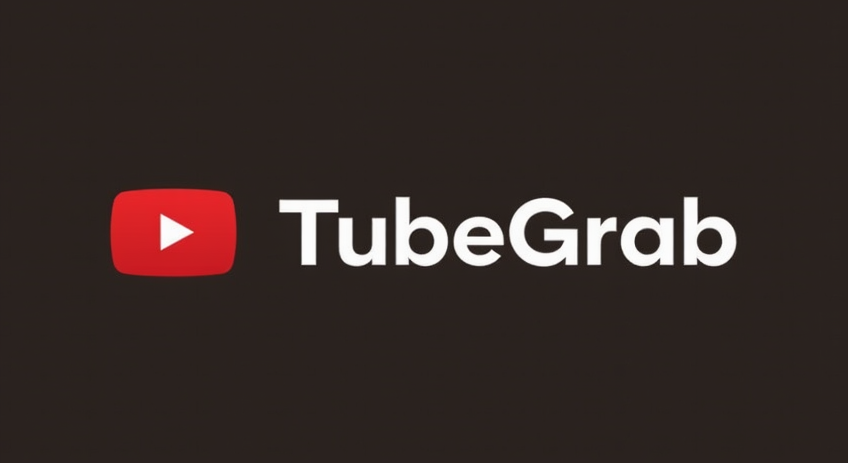

# TubeGrab



TubeGrab is a minimal YouTube downloader utility written in Go. It allows you to download YouTube videos by providing the video URL. The tool fetches the video information, selects the best available quality with audio, and saves the video to your local directory.

## Features

- **Simple and Lightweight**: TubeGrab is designed to be a minimal utility with no unnecessary dependencies.
- **Command-Line Interface**: Easily download videos by passing the YouTube URL as a command-line argument.
- **Automatic Quality Selection**: The tool automatically selects the best available quality with audio.
- **Sanitized File Names**: Ensures that the downloaded file names are valid by removing invalid characters.

## Installation

1. **Install Go**: Ensure you have Go installed on your system. You can download it from [here](https://golang.org/dl/).

2. **Clone the Repository**:
   ```bash
   git clone https://github.com/makalin/TubeGrab.git
   cd TubeGrab
   ```

3. **Build the Tool**:
   ```bash
   go build -o tg
   ```

4. **Run the Tool**:
   ```bash
   ./tg <YouTube URL>
   ```

## Usage

To download a YouTube video, simply run the `tg` command followed by the YouTube video URL:

```bash
./tg https://www.youtube.com/watch?v=example
```

The video will be downloaded to the current directory with a sanitized file name based on the video title.

## Example

```bash
./tg https://www.youtube.com/watch?v=dQw4w9WgXcQ
```

This command will download the video and save it as `Never_Gonna_Give_You_Up.mp4` (or a similar sanitized name) in the current directory.

## Dependencies

TubeGrab uses the [youtube](https://github.com/kkdai/youtube) package by kkdai to interact with YouTube and download videos.

## Contributing

Contributions are welcome! Please feel free to submit a pull request or open an issue if you find any bugs or have suggestions for improvements.

## License

This project is licensed under the MIT License. See the [LICENSE](LICENSE) file for more details.

---

Enjoy downloading your favorite YouTube videos with TubeGrab! 🎥
